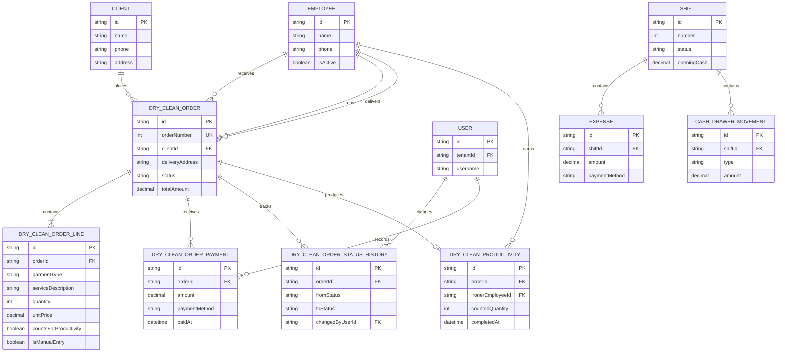

# Dry Clean Operations

نظام تشغيل وإدارة مغسلة جاف وتنظيف وكي. النظام يسجل طلب العميل، تفاصيل كل قطعة، الموظف المستلم، المكوجي، حالة الطلب، المدفوعات، التسليم، وإنتاجية المكوجي. الواجهة عربية وRTL، والـ backend يخدم الـ API والواجهة المبنية من نفس البرنامج.

## التشغيل السريع

المتطلبات: Windows، .NET Framework 4.8 Developer Pack، وNode.js.

```powershell
npm install
npx tsc --noEmit
npm run lint
npm test
npm run build
dotnet build backend-cs/pos-cs.csproj --configuration Release
```

للتشغيل المحلي:

```powershell
npm run dev
dotnet run --project backend-cs/pos-cs.csproj
```

في نسخة التشغيل، شغّل `start.bat`. الـ backend يعمل على `http://localhost:3001` ويطبق migration `backend-cs/Database/Migrations/001_dry_clean_baseline.sql` تلقائيًا. قاعدة البيانات تُحفظ في مجلد `data/` بجانب البرنامج.

بيانات الدخول الافتراضية: `admin` / `1234`. يجب تغييرها بعد أول دخول.

## البنية

- `backend-cs/`: C# .NET Framework 4.8، OWIN Web API، Dapper وSQLite.
- `src/`: Next.js static export، React، TypeScript وTanStack Query.
- `backend-cs/Database/Migrations/`: schema واحدة جديدة للنظام.
- `messages/ar.json`: الترجمة العربية.
- `docs/DRY-CLEAN-PLAN.md`: الخطة.
- `docs/DRY-CLEAN-SPEC.md`: المواصفات التفصيلية.
- [`BUSINESS-LOGIC.md`](BUSINESS-LOGIC.md): الـ workflow والـ constraints.

## أوامر مفيدة

| الأمر | الاستخدام |
|---|---|
| `npm run dev` | تشغيل واجهة التطوير |
| `npm run build` | بناء الواجهة كـ static export |
| `npm run lint` | فحص ESLint |
| `npm test` | تشغيل Vitest |
| `dotnet build backend-cs/pos-cs.csproj --configuration Release` | بناء السيرفر |

## Database ERD



## النسخ الاحتياطي

النسخ المحلية والرفع الاختياري إلى Cloudinary متاحان من `/api/backups`. إعدادات Cloudinary تُقرأ من متغيرات البيئة `POS_CLOUDINARY_CLOUD_NAME` و`POS_CLOUDINARY_API_KEY` و`POS_CLOUDINARY_API_SECRET`. عدم ضبطها لا يمنع تشغيل النظام المحلي.

## الترخيص والصلاحيات

كل endpoint — باستثناء تسجيل الدخول وفحص الترخيص — يحتاج Bearer token وصلاحية مناسبة. تفاصيل الصلاحيات في `docs/PERMISSIONS.md`.
